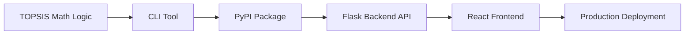
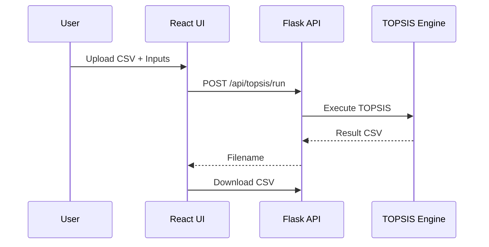

# 🚀 TOPSIS Web Service — From Algorithm to Cloud Deployment

A **full-stack, production-ready implementation of the TOPSIS (Technique for Order Preference by Similarity to Ideal Solution)** method, built step-by-step to mirror **real-world software engineering practices**.

This repository is not just about TOPSIS — it documents the **entire engineering journey**:

> **Algorithm → CLI → PyPI → Backend API → Frontend UI → Cloud Deployment**

---

## 📌 What is TOPSIS?

**TOPSIS (Technique for Order Preference by Similarity to Ideal Solution)** is a widely used **Multi-Criteria Decision Making (MCDM)** technique.

### Core Principle

* The **best alternative** is the one **closest to the ideal best solution**
* And **farthest from the ideal worst solution**

It is commonly used in:

* Engineering design decisions
* Supplier selection
* Financial analysis
* Ranking problems

---

## 🧭 Project Vision

The goal of this project was **not** to stop at a working algorithm.
Instead, the aim was to answer:

> *“How would TOPSIS look if it were built like a real product?”*

That led to a **multi-phase build**, documented below.

---

## 🛠️ Phase-Wise Build Journey



---

## 🧮 Phase 1 — Core TOPSIS Algorithm

* Implemented from scratch in Python
* Steps implemented:

  * Decision matrix normalization
  * Weight application
  * Ideal best & ideal worst vectors
  * Euclidean distance calculation
  * TOPSIS score & ranking

✔ Correctness verified using sample datasets

---

## 💻 Phase 2 — Command Line Interface (CLI)

The algorithm was wrapped into a **command-line program**.

### CLI Usage

```bash
topsis input.csv "1,1,1" "+,+,-" output.csv
```

### CLI Validations

* Correct number of arguments
* Input file existence
* Minimum 3 columns
* Numeric criteria values only
* Equal number of weights, impacts, and criteria
* Impacts must be `+` or `-`

---

## 📦 Phase 3 — PyPI Package

To make the logic reusable and professional:

* Converted the CLI tool into a **PyPI package**
* Published as:

```text
Topsis-Siddharth-102303592
```

### Benefits

* No code duplication later
* Backend simply *installs and uses* the package
* Separation of algorithm and application layers

---

## 🌐 Phase 4 — Flask Backend (Web Service)

A Flask API was built on top of the PyPI package.

### API Responsibilities

* Accept CSV uploads
* Validate inputs (server-side)
* Execute TOPSIS via installed package
* Generate result CSV
* Serve downloadable output

### API Endpoint

```http
POST /api/topsis/run
```

---

## 🎨 Phase 5 — React Frontend

A modern, interactive frontend was created using **React**.

### Frontend Features

* Dark theme UI
* Animated interactions
* CSV upload interface
* Instant client-side validation
* Result CSV download

### Client-Side Validations

All assignment rules are enforced **before API call**:

| Rule                         | Status |
| ---------------------------- | ------ |
| Correct number of parameters | ✅      |
| File selected                | ✅      |
| Minimum 3 columns            | ✅      |
| Numeric criteria values      | ✅      |
| Weights = Impacts = Criteria | ✅      |
| Impacts only `+` or `-`      | ✅      |
| Comma-separated inputs       | ✅      |
| Clear error messages         | ✅      |

---

## 🧩 Frontend–Backend Interaction



---

## 🏗️ Phase 6 — Single-Service Production Build

Instead of deploying frontend and backend separately:

* React was **built for production**
* Build files were moved into Flask’s `static/` folder
* Flask serves:

  * `/` → React UI
  * `/api/*` → API

This results in **one clean deployment**.

---

## ☁️ Phase 7 — Cloud Deployment (Render)

The application was deployed as a **single Python web service** on **Render**.

### Render Configuration

```text
Runtime: Python 3
Build Command: pip install -r backend/requirements.txt
Start Command: python backend/app.py
```

### Port Binding (Critical Fix)

```python
port = int(os.environ.get("PORT", 5000))
app.run(host="0.0.0.0", port=port)
```

This ensures the app is reachable on Render’s public URL.

---

## 🌍 Live Application

```text
https://topsis-web-service-yfsi.onrender.com
```

---

## 📁 Final Project Structure

```
Topsis-Web-Service/
│
├── backend/
│   ├── app.py
│   ├── api/
│   ├── services/
│   ├── static/        # React production build
│   ├── uploads/
│   ├── results/
│   └── requirements.txt
│
├── frontend/
│   └── topsis-frontend/
│
└── README.md
```

---

## 🧑‍💻 Author

**Siddharth Jaswal**


---

## 🏁 Why This Project Matters

✔ Demonstrates algorithmic correctness
✔ Shows real-world validation handling
✔ Clean frontend-backend separation
✔ Production deployment knowledge
✔ Strong portfolio & viva project

---

## 📜 License

MIT License

---

> *“This project was built not just to compute rankings, but to understand how real software evolves from an idea to a deployed system.”*
